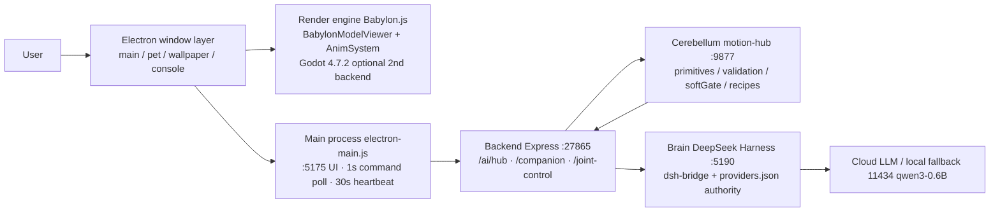

# RuanRuan Desktop Pet · System Architecture · English

> Companion topology diagram (standalone SVG): [docs/architecture_en.svg](architecture_en.svg) · 中文: [ARCHITECTURE_zh.md](ARCHITECTURE_zh.md) / [architecture_zh.svg](architecture_zh.svg)
> Written for **both human and AI readers**: the big picture first, then port-precise anchors.

## 1. Overview

RuanYun Desktop Pet = **Electron shell + Babylon.js rendering + backend API (brain interface layer) + motion-core cerebellum (motion protocol layer) + DeepSeek Harness (brain workbench)**.

## 2. Port table (single source of truth, matches code)

| Port | Process | Role |
|---|---|---|
| 5175 | Static server inside main process | UI (frontend/dist) + `/pet-tmp` model transfer + `/scene3d` assets + speech-bridge API |
| 27865 | Backend Express | `/ai/hub/ask` (runBrain + [MOTION] extraction), `/companion` (idle scheduler), `/joint-control` (command queue TTL 30s), `/motion`, `/device`, … |
| 9877 | motion-hub (motion-core) | Motion primitive library / param validation / softGate / recipes; solve posts back into the 27865 queue |
| 5190 | DSH Web | DeepSeek Harness workbench (embedded in /chat iframe) |
| 9880 | Godot renderer | Optional second render backend (TCP commands; SetParent-embedded into the preview area) |
| 5181 | gui-agent | One-sentence desktop automation (used by pet-mcp `gui_task`) |
| 5180 | browser-search | Local headless search (Playwright) |
| 11434 | Local fallback model (llama.cpp) | Built-in qwen3-0.6B (`scripts/start-local-model.bat`; weights via ModelScope); thinking off / temp 0.7 / ctx 2048 / CPU-ready |

## 3. Key flows

### 3.1 Conversation → motion (main chain)
1. User speaks/types → `NewPage` → `POST /api/v1/ai/hub/ask`
2. `runBrain`: DSH CLI → cloud providers.json (active provider wins; placeholder keys never overwrite real ones) → local fallback
3. `[MOTION]` tags extracted from the reply (Chinese keyword fallback if absent) → `enqueuePetAction` (whitelist + cooldown) into the 27865 queue (TTL 30s)
4. Main process polls `GET /joint-control/pending` every 1s → IPC `joint-command` broadcast to main/pet/wallpaper windows (+ forwarded to Godot via TCP 9880)
5. Renderer `JointControlService` executes serially → `__petAction` / `__playStdMotion` / `__playVmdClip` → completion posted back to `POST /joint-control/result`

### 3.2 Idle companionship (wired 2026-10)
1. Main process heartbeats every 30s: `POST /companion/idle-tick {kind:'idle', inCall, systemIdleSec}`
2. `companion.ts` is the **single rhythm owner**: within one heartbeat it first evaluates the hourly beat (deferred during calls; at night the stretch happens but the line is muted), then idle actions (no conversation for ≥3min; non-repeating shuffle bag; when the bag empties the AI choreographs 1–3 steps into `data/companion/generated/`, 2GB / 300-file quota)
3. A spoken line returns via the `line` field → main process → `companion:speak` IPC → renderer `companionSpeakTTS` (respects the master voice switch)

### 3.3 Voice
Microphone → speech-bridge (separate Edge page; anti-throttling flags + Web Worker heartbeat) → `:5175/api/speech-bridge/*` → DSH composer dictation; TTS via the main-process-hosted tts_server.

### 3.4 Render forms
- **The main-window preview is the single Babylon render source**; pet/wallpaper windows run their own engines (the FrameBroadcaster frame-stream exists but is not wired).
- **Godot 4.7.2 optional second render backend**: the same command stream is forwarded (TCP 9880) and the window can be SetParent-embedded into the preview area; the Babylon chain stays untouched and reversible at any time.
- The wallpaper window is fullscreen transparent on WorkerW (beneath desktop icons); mouse pass-through is decided per-frame by renderer ray-picking.

### 3.5 3D scene (added 2026-10)
- Editor layer `window.__scene3d` (multi-model / drag / XYZ rotate-scale / bone posing / backgrounds / layout apply), gated by editMode so the primary model's motion pipeline is never touched.
- Assets are stored via IPC `scene3d:save-asset` into `<app>/frontend-dist/scene3d/` (served on :5175); the layout JSON lives in userData; the wallpaper window applies the same layout on load (scope: preview / wallpaper / both).
- Imported extra models auto-fit to the primary model's scale and are placed beside it; reset sends everything back to default import positions.

## 4. Brain: DeepSeek Harness (attribution)

- **DSH © DeepSeek**: this project integrates its workbench & automation runtime (`/chat` iframe, dsh runtime, pet-mcp/playwright-mcp tools), bridged by `frontend/dsh-bridge/dshHarness.js` (start / reuse checks / token pipe / self-heal watchdog).
- **The single API authority is DSH's `providers.json`** (inside dsh-workspace); software-side placeholder keys never overwrite real DSH keys; `model-map.json` is the cold-start source.
- Only **local adaptation patches** are applied to DSH (e.g., removal of a broken plugin, cordis.patch pointing to app-side dsh-mcp). No DSH source is included or redistributed. See [THIRD_PARTY.md](THIRD_PARTY.md).

## 5. Known limitations (honest list)

- `activity` timestamps are in-memory (reset when the backend restarts; "never talked = naturally idle").
- FrameBroadcaster (frame stream) is built but not wired; pet/wallpaper run separate engines today.
- The joint-control `/result` receipt can be overwritten by the later reporter under multi-window broadcast (the first result may be lost).
- vmdClip driving writes quaternions directly (bypassing safeRotateJoint guards) — asset authors must respect KINEMATICS limits themselves (in-repo generators ship with validators).
- Code-review findings and dispositions live in `00-工程变更记录.md` and the final review report.
