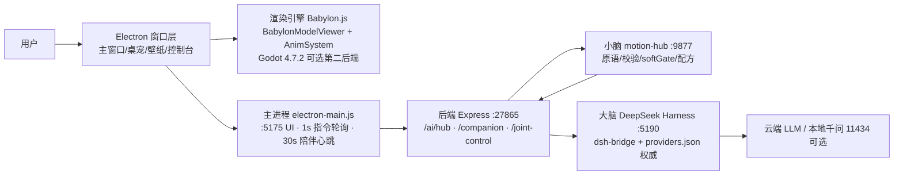

# 阮阮桌面宠物 · 系统架构 · 中文

> 配套拓扑图（SVG，可单独打开）：[docs/architecture_zh.svg](architecture_zh.svg) · English: [ARCHITECTURE_en.md](ARCHITECTURE_en.md) / [architecture_en.svg](architecture_en.svg)
> 本文面向**人类与 AI 双读者**：先给人看懂全貌，再给 AI 精确到端口的锚点。

## 1. 总览

阮云小宠 = **Electron 桌面壳 + Babylon.js 渲染 + 后端 API（大脑接口层）+ motion-core 小脑（动作协议层）+ DeepSeek Harness（大脑工作台）**。

## 2. 端口表（唯一事实，与代码一致）

| 端口 | 进程 | 职责 |
|---|---|---|
| 5175 | 主进程内静态服务 | UI（frontend/dist）+ `/pet-tmp` 模型中转 + `/scene3d` 资产 + speech-bridge API |
| 27865 | 后端 Express | `/ai/hub/ask`（runBrain + [MOTION] 抽取）、`/companion`（闲置陪伴调度）、`/joint-control`（指令队列 TTL 30s）、`/motion`、`/device` 等 |
| 9877 | motion-hub（motion-core） | 动作原语库/参数校验/softGate/配方编排；solve 后回投 27865 队列 |
| 5190 | DSH Web | DeepSeek Harness 工作台（/chat iframe 内嵌） |
| 9880 | Godot 渲染端 | 可选第二渲染后端（TCP 指令；SetParent 嵌入主窗口预览区） |
| 5181 | gui-agent | 一句话桌面自动化（pet-mcp `gui_task` 调用） |
| 5180 | browser-search | 本地无头检索（Playwright） |
| 11434 | 本地千问（外置） | 可选本地模型；**不随软件启动**，桌面 `qwen2.5-3b` 手动开 |

## 3. 关键链路

### 3.1 对话与动作（主链）
1. 用户说话/打字 → `NewPage` → `POST /api/v1/ai/hub/ask`
2. `runBrain`：DSH CLI → 云端 providers.json（active 生效，占位 key 不覆盖真 key）→ 本地兜底
3. 回复正文抽 `[MOTION]` 标记（无标记走中文关键词兜底）→ `enqueuePetAction`（白名单+冷却）入 27865 队列（TTL 30s）
4. 主进程 1s 轮询 `GET /joint-control/pending` → IPC `joint-command` 广播主/宠/壁纸三窗口（+Godot 转发 TCP 9880）
5. 渲染端 `JointControlService` 串行执行 → `__petAction`/`__playStdMotion`/`__playVmdClip` → 完成回传 `POST /joint-control/result`

### 3.2 闲置陪伴（2026-10 接线）
1. 主进程 30s 心跳 `POST /companion/idle-tick {kind:'idle', inCall, systemIdleSec}`
2. 后端 companion.ts 是**唯一节奏管理者**：同一心跳内先判「小时节拍」（通话中顺延、夜间静音只动不说）再判「闲置小动作」（距上次对话 ≥3min，动作袋不重复轮回，袋空时 AI 现编并存入 `data/companion/generated/`，2GB/300 个配额）
3. 台词经响应 `line` 字段回主进程 → `companion:speak` IPC → 渲染端 `companionSpeakTTS`（尊重语音总开关）

### 3.3 语音
麦克风 → speech-bridge（独立 Edge 页，防节流 flags + Web Worker 心跳）→ `:5175/api/speech-bridge/*` → DSH composer 听写；TTS 走主进程托管的 tts_server。

### 3.4 渲染形态
- **主窗口预览 = 唯一 Babylon 渲染源**；桌宠/壁纸窗口各自独立引擎（FrameBroadcaster 帧流方案已建成未接线）。
- **Godot 4.7.2 可选第二渲染后端**：指令流同步转发（TCP 9880），可 SetParent 嵌入主窗口预览区；Babylon 链路全程不动，随时可回。
- 壁纸窗口全屏透明挂 WorkerW（图标层之下），鼠标穿透由渲染端 ray-pick 决定。

### 3.5 3D 场景（2026-10 新增）
- 编辑层 `window.__scene3d`（多模型/拖拽/XYZ 旋转缩放/骨骼姿态/背景/布局应用），交互按 editMode 门控，不碰主模型动作管线。
- 资产经 IPC `scene3d:save-asset` 落盘 `<app>/frontend-dist/scene3d/`（:5175 直达）；布局 JSON 存 userData；壁纸窗口挂载时 `applyLayout` 应用同布局（生效范围三选：预览/壁纸/两者）。
- 额外模型导入后自动适配主模型比例并摆到旁边；重置=全部回默认导入位。

## 4. 大脑：DeepSeek Harness（标注）

- **DSH © DeepSeek**：本项目集成其工作台与自动化运行时（`/chat` iframe、dsh runtime、pet-mcp/playwright-mcp 工具），经 `frontend/dsh-bridge/dshHarness.js` 桥接（start/复用判据/token 管道/自愈看门狗）。
- **API 配置唯一权威 = DSH 的 `providers.json`**（dsh-workspace 内）；软件侧占位 key 永不覆盖 DSH 真 key；`model-map.json` 为冷启动源。
- 本项目对 DSH 仅做**本地适配补丁**（如问题插件摘除、cordis.patch 指向 app 侧 dsh-mcp），不包含、不重新分发 DSH 源码。详见 [THIRD_PARTY.md](THIRD_PARTY.md)。

## 5. 已知边界（诚实清单）

- `activity` 时间戳为内存态（后端重启归零，"从未对话=天然闲置"）。
- FrameBroadcaster（帧流）已建成未接线；桌宠/壁纸现为独立引擎。
- 指令 `/result` 回执在多窗口广播下会被后执行方覆盖（先到结果可能丢失）。
- vmdClip 驱动为直写四元数（不经 safeRotateJoint 守卫）——资产作者必须自行遵守 KINEMATICS 极限（工程内生成器自带校验）。
- 代码检查发现项与处置见 `00-工程变更记录.md` 与终审报告。
